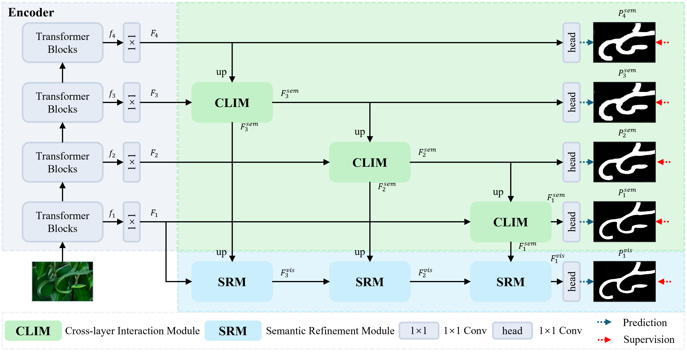
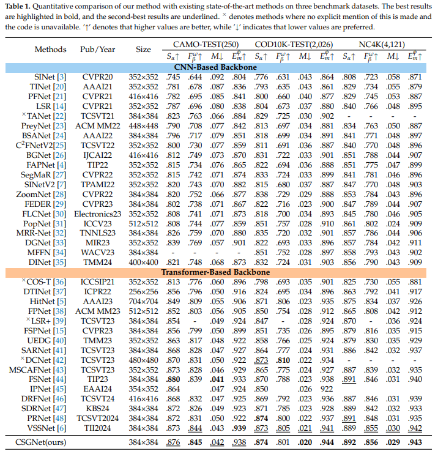

# Cross-Layer Semantic Guidance Network for Camouflaged Object Detection




# 1. Abstract

> Camouflaged Object Detection (COD) is a challenging task in computer vision due to the high visual similarity between camouflaged objects and their surrounding environments. Traditional methods relying on the late-stage fusion of high-level semantic features and low-level visual features have reached a performance plateau, limiting their ability to accurately segment object boundaries or enhance object localization. This paper proposes the Cross-layer Semantic Guidance Network (CSGNet), a novel framework designed to progressively integrate semantic and visual features across multiple stages, addressing these limitations. CSGNet introduces two innovative modules: the Cross-Layer Interaction Module (CLIM) and the Semantic Refinement Module (SRM). CLIM facilitates continuous cross-layer semantic interaction, refining high-level semantic information to provide consistent and effective guidance for detecting camouflaged objects. Meanwhile, SRM leverages this refined semantic guidance to enhance low-level visual features, employing feature-level attention mechanisms to suppress background noise and highlight critical object details. This progressive integration strategy ensures precise object localization and accurate boundary segmentation across challenging scenarios. Extensive experiments on three widely used COD benchmark datasets---CAMO, COD10K, and NC4K---demonstrate the effectiveness of CSGNet, achieving state-of-the-art performance with a mean error~($M$) of $0.042$ on CAMO, $0.020$ on COD10K, and $0.029$ on NC4K.


# 2. Results




# 3. Preparations

## 3.1 Datasets


## 3.2 Create and activate conda environment

```bash
conda create -n CSGNet python=3.8
conda activate CSGNet

git clone https://github.com/ycyinchao/CSGNet.git
cd CSGNet

pip install -r requirement.txt
```


## 3.3 Download Pre-trained weights

The pretrained model is stored in [Google Drive](https://drive.google.com/file/d/1rKmp0Zu1ZL6Z9VsYfYAKRkG271AvZB6G/view?usp=sharing). After downloading, please put it in the './pretrained/' fold.


## 3.4 Train

```bash
python Train.py
```

Our well-trained model is stored in [Google Drive](https://drive.google.com/file/d/148ENXW_kbgXC9x0pBXGO__hgzqpK1alr/view?usp=drive_link), which should be moved into the fold './checkpoints/CSGNet/'.


## 3.5 Test

```bash
python MyTesting.py --pth_path 'the path of checkpoint'
```

The more qualitative results of CSGNet on four benchmarks (COD10K, NC4K, CAMO, CHAMELEON) have already been stored in [Google Drive](https://drive.google.com/file/d/1wP1nWcS2cPX4-s0mPEoiudXOkqh63aJV/view?usp=drive_link), please unzip it into the fold './results/'.


## 3.6 Eval

```bash
python test_metrics.py
```

the results of evaluation are also in [Google Drive](https://drive.google.com/file/d/1wP1nWcS2cPX4-s0mPEoiudXOkqh63aJV/view?usp=drive_link).


# 4. Citation

Please kindly cite our paper if you find it's helpful in your work.

```
@article{he2025cross,
  title={Cross-Layer Semantic Guidance Network for Camouflaged Object Detection},
  author={He, Shiyu and Yin, Chao and Li, Xiaoqiang},
  journal={Electronics},
  volume={14},
  number={4},
  pages={779},
  year={2025},
  publisher={MDPI AG}
}
```


# 5. License

The source code is free for research and education use only. Any commercial use should get formal permission first.

